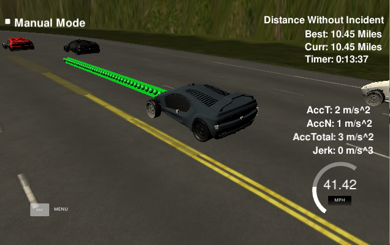

# CarND-Path-Planning-Project
Self-Driving Car Engineer Nanodegree Program
   
## Write up

### Goals
In this project your goal is to safely navigate around a virtual highway with other traffic that is driving +-10 MPH of the 50 MPH speed limit. You will be provided the car's localization and sensor fusion data, there is also a sparse map list of waypoints around the highway. The car should try to go as close as possible to the 50 MPH speed limit, which means passing slower traffic when possible, note that other cars will try to change lanes too. The car should avoid hitting other cars at all cost as well as driving inside of the marked road lanes at all times, unless going from one lane to another. The car should be able to make one complete loop around the 6946m highway. Since the car is trying to go 50 MPH, it should take a little over 5 minutes to complete 1 loop. Also the car should not experience total acceleration over 10 m/s^2 and jerk that is greater than 50 m/s^3.

#### The map of the highway is in data/highway_map.txt
Each waypoint in the list contains  [x,y,s,dx,dy] values. x and y are the waypoint's map coordinate position, the s value is the distance along the road to get to that waypoint in meters, the dx and dy values define the unit normal vector pointing outward of the highway loop.

The highway's waypoints loop around so the frenet s value, distance along the road, goes from 0 to 6945.554.

#### Main car's localization Data (No Noise)

["x"] The car's x position in map coordinates

["y"] The car's y position in map coordinates

["s"] The car's s position in frenet coordinates

["d"] The car's d position in frenet coordinates

["yaw"] The car's yaw angle in the map

["speed"] The car's speed in MPH

#### Previous path data given to the Planner

//Note: Return the previous list but with processed points removed, can be a nice tool to show how far along
the path has processed since last time. 

["previous_path_x"] The previous list of x points previously given to the simulator

["previous_path_y"] The previous list of y points previously given to the simulator

#### Previous path's end s and d values 

["end_path_s"] The previous list's last point's frenet s value

["end_path_d"] The previous list's last point's frenet d value

#### Sensor Fusion Data, a list of all other car's attributes on the same side of the road. (No Noise)

["sensor_fusion"] A 2d vector of cars and then that car's [car's unique ID, car's x position in map coordinates, car's y position in map coordinates, car's x velocity in m/s, car's y velocity in m/s, car's s position in frenet coordinates, car's d position in frenet coordinates. 
___

## Criterias
___

### Valid trajectories
___

### The car is able to drive at least 4.32 miles without incident.

*The top right screen of the simulator shows the current/best miles driven without incident. Incidents include exceeding acceleration/jerk/speed, collision, and driving outside of the lanes. Each incident case is also listed below in more detail.*

As shown in the included video and screenshot, the car is able to drive around the track for several rounds. Also it does drive close to the maximum speed and achieves each round in about 5 minutes (depending on traffic).

___

### The car drives according to the speed limit.

*The car doesn't drive faster than the speed limit. Also the car isn't driving much slower than speed limit unless obstructed by traffic.*

The car will go to 49 mph, if no vehicle in front of it is driving slower than that. The car slows down to match the speed of other vehicles in the same lane, if approaching closer than 30m. If it hast to slow down and matched the vehicle speed, it will consider a lane change

                double front_car_v = 55.;
                
                //braking
                if(ref_vel > (front_car_v - 5.)){
                    ref_vel -= 1.0;
                    printf("Vehicle in front, braking to %f to reach car %f\n", ref_vel, front_car_v - 5.);
                    
                    if (ref_vel < (front_car_v - 3.)){
                        printf("Equal speed to vehicle in front, prepare lane shift %f\n", ref_vel);
                        
                        //Go to prepare lane shift state
                        curr_state = 1;
                    }
                }

                //accelerate
                else if(ref_vel < (front_car_v - 5.) && (ref_vel < 49.0)){
                    ref_vel += 0.5;
                    printf("Accelerationg to %f\n", ref_vel);
                }

                //stay at max ref_vel
                else{
                    printf("Driving at max. speed %f\n", ref_vel);
                }
___

### Max Acceleration and Jerk are not exceeded.

*The car does not exceed a total acceleration of 10 m/s^2 and a jerk of 10 m/s^3.*

The car is only allowed to accelerate up to 0.5 or brake up to 1.0 per step. This will restrict it to approx. 4m/s^2 and 8m/s^2 of acceleration. It is reasonable to brake harder than accelerating to avoid collisions with other cars when approaching to fast.

___

### Car does not have collisions.

*The car must not come into contact with any of the other cars on the road.*

The car is detecting vehicles in its ego lane. If it approaches closer than 30m, the speed of the front car is evaluated and the car is slowing down to match the speed. If a car accelerates in front and clears that distance, the own car is accelerating again. Also lane changes are only effectuated, when neigboring lanes are clear to avoid collisions.

                //check all cars in sensor fusion
                for(int i = 0; i < sensor_fusion.size(); i++){

                    //check lane of current other car (d value)
                    float check_d = sensor_fusion[i][6];

                    //check for cars in ego lane
                    if((check_d < (2+4*curr_lane+2)) && (check_d > (2+4*curr_lane-2))){

                        double vx = sensor_fusion[i][3];
                        double vy = sensor_fusion[i][4];
                        double check_v = sqrt(vx*vx+vy*vy);
                        double check_s = sensor_fusion[i][5];

                        check_s += ((double)prev_size * 0.02 * check_v);

                        if((check_s > car_s) && ((check_s - car_s) < 30.)){

                            if(front_car_v > (check_v)){
                                front_car_v = check_v * 2.237;
                                printf("new speed of vehicle front is %f\n", front_car_v);
                            }
                        }
                    }
                }

### The car stays in its lane, except for the time between changing lanes.

*The car doesn't spend more than a 3 second length out side the lane lanes during changing lanes, and every other time the car stays inside one of the 3 lanes on the right hand side of the road.*

A lane change is execute over an distance of approx. 30m, therefore each lane change will take less than 3s and the car will only execute the lane change, when considered safe. A lane change is executed if no car in front is closer than 31m in front and 20m backwards in the goal lane. This is checked in a prepare lane change state. Until then it drives in its own lane, accelerating and braking when necessary to follow other vehicles.

    /*
     * states:
     * 0 - drive straight
     * 1 - prepare lane shift
     * 2 - do lane shift left
     * 3 - do lane shift right
    */
    
___

### The car is able to change lanes

*The car is able to smoothly change lanes when it makes sense to do so, such as when behind a slower moving car and an adjacent lane is clear of other traffic.*

Lane changes are effectuated by defined a new reference lane different to the current lane. The spline will be fitted from the current position to the new position in a different lane in 30m and it will do a smooth lane shift respecting acceleration and yerk maxima.

A lane change is considered, when slowing down in the ego lane due to a car in front.
In a prepare lane change state, the neighboring lanes are checked for cars. Only if no cars are found within +31m and -20m, the lane change will be executed.

A change to its left lane is always prefered over the right lane, if both lanes are free, otherwise the free lane will be choosen.

If the car is in the outer left lane, only right lane changes are considered. The same applies for the outer right lane.

                else if (curr_state == 1) {
                printf("State 1, prepare lane change with %f\n", ref_vel);

                bool left_lane_safe = true;
                bool right_lane_safe = true;
                bool changed_lanes = false;

                for (int i = 0; i < sensor_fusion.size(); i++) {

                    //check lane of current other car (d value)
                    float check_d = sensor_fusion[i][6];

                    //check for cars in left lane (if existing)
                    if (curr_lane >= 1) {
                        if (check_d < (2 + 4 * (curr_lane - 1) + 2) && check_d > (2 + 4 * (curr_lane - 1) - 2)) {

                            double vx = sensor_fusion[i][3];
                            double vy = sensor_fusion[i][4];
                            double check_v = sqrt(vx * vx + vy * vy);
                            double check_s = sensor_fusion[i][5];

                            check_s += ((double) prev_size * .02 * check_v);
                            double dist_s = check_s - car_s;

                            if (dist_s < 31 && dist_s > -20) {
                                //vehicle found nearby on left lane
                                left_lane_safe = false;
                            }
                        }
                    }

                    //check for cars in right lane
                    if (curr_lane <= 1) {
                        if (check_d < (2 + 4 * (curr_lane + 1) + 2) && check_d > (2 + 4 * (curr_lane + 1) - 2)) {

                            double vx = sensor_fusion[i][3];
                            double vy = sensor_fusion[i][4];
                            double check_v = sqrt(vx * vx + vy * vy);
                            double check_s = sensor_fusion[i][5];

                            check_s += ((double) prev_size * .02 * check_v);
                            double dist_s = check_s - car_s;
                            if (dist_s < 31 && dist_s > -20) {
                                right_lane_safe = false;
                            }
                        }
                    }

                    //check if surrounding vehicles do exist otherwise do lane change
                    if (curr_lane == 0) {
                        if (right_lane_safe) {
                            printf("right lane safe %i\n", right_lane_safe);;
                            curr_state = 3;
                        } else {
                            curr_state = 0;
                        }
                    } else if (curr_lane == 2) {
                        if (left_lane_safe) {
                            printf("left lane safe %i\n", left_lane_safe);
                            curr_state = 2;
                        } else {
                            curr_state = 0;
                        }
                    } else if (curr_lane == 1) {
                        if (left_lane_safe) {
                            printf("left lane safe %i\n", left_lane_safe);
                            curr_state = 2;
                        } else if (right_lane_safe) {
                            printf("right lane safe %i\n", right_lane_safe);
                            curr_state = 3;
                        } else {
                            curr_state = 0;
                        }

                    } else {
                        printf("Wait for lane change, vehicles present, %f\n", ref_vel);
                        //go back to straight (adjust speed eventually)
                        curr_state = 0;
                    }
                }
            }

            //Execute the lane shift left
            else if (curr_state == 2){
                printf("State 2, execute left lane change with %f\n", ref_vel);
                //check for vehicles in front
                bool too_close = false;

                if(curr_lane >= 1){
                    curr_lane -= 1;
                }

                curr_state = 0;
            }

            //Execute the lane shift
            else if (curr_state == 3){
                printf("State 3, execute right lane change with %f\n", ref_vel);
                //check for vehicles in front
                bool too_close = false;

                if (curr_lane <= 1){
                    curr_lane += 1;
                }
                curr_state = 0;
            }
___

## Reflection
___

### There is a reflection on how to generate paths.

The code model for generating paths is described in detail. This can be part of the README or a separate doc labeled "Model Documentation".

* The code for generating paths in capsuled in a car object. 
* A new car is generating when starting the program.

* A car has the attributes:
    
            /*
             * vehicle parameter
             */
            double curr_x; //cartesian coordinates
            double curr_y; //cartesian coordinates
            double curr_s; //frenet coordinates
            double curr_d; //frenet coordinates
            double curr_yaw; //yaw acc
            double curr_speed; //speed

            /*
            * vehicle path
            */
            int prev_size;
            std::vector<double> prev_path_x;
            std::vector<double> prev_path_y;
            std::vector<double> next_x_vals;
            std::vector<double> next_y_vals;

            int curr_lane  = 1;
            double curr_vel = 0; //mph

            /*
             * map informations
             */
            std::vector<double> maps_x;
            std::vector<double> maps_y;
            std::vector<double> maps_s;

* A car has the following functions
    * update its position information (done after each new message)

            void UpdatePosition(double car_x, double car_y, double car_s, double car_d, double car_yaw, double car_speed, double ref_vel, int car_lane);
    
    * update its map informations (done after each new message)
    
            void UpdateMap(std::vector<double> map_waypoints_x, std::vector<double> map_waypoints_y, std::vector<double> map_waypoints_s);
    
    * update its previous path informations
    
            void UpdatePath(std::vector<double> previous_path_x, std::vector<double> previous_path_y);

    * generate a new path to follow the lane, change lanes and keep the ref_velocity
    
            void CreatePath();
___

### CreatePath()

The car is generating a car using a spline fitted to reference points

* last position
* current position
* desired positions in 30m, 60m and 90m

             // Create a list of widely spaced (x,y) points
            vector<double> ptsx;
            vector<double> ptsy;

            //define ref values
            double ref_x = curr_x;
            double ref_y = curr_y;
            double ref_yaw = helper::deg2rad(curr_yaw);

            next_x_vals.clear();
            next_y_vals.clear();

            //check size of prev_points
            if(prev_size < 2){
                //create two initial points tangent to the car
                double prev_curr_x = curr_x - cos(curr_yaw);
                double prev_curr_y = curr_y - sin(curr_yaw);

                //add initial points to pts
                ptsx.push_back(prev_curr_x);
                ptsy.push_back(prev_curr_y);

                //add curr points to pts
                ptsx.push_back(curr_x);
                ptsy.push_back(curr_y);

            }
            else{
                //get previous path end points as initial points
                ref_x = prev_path_x[prev_size-1];
                ref_y = prev_path_y[prev_size-1];

                double ref_x_prev = prev_path_x[prev_size-2];
                double ref_y_prev = prev_path_y[prev_size-2];

                ref_yaw = atan2(ref_y - ref_y_prev, ref_x - ref_x_prev);

                //add points to pts
                ptsx.push_back(ref_x_prev);
                ptsy.push_back(ref_y_prev);

                ptsx.push_back(ref_x);
                ptsy.push_back(ref_y);
            }

            //add additional points in 30m steps to the vector
            vector<double> next_wp0 = helper::getXY(curr_s + 30, (2+4*curr_lane), maps_s, maps_x, maps_y);
            vector<double> next_wp1 = helper::getXY(curr_s + 60, (2+4*curr_lane), maps_s, maps_x, maps_y);
            vector<double> next_wp2 = helper::getXY(curr_s + 90, (2+4*curr_lane), maps_s, maps_x, maps_y);

            ptsx.push_back(next_wp0[0]);
            ptsy.push_back(next_wp0[1]);

            ptsx.push_back(next_wp1[0]);
            ptsy.push_back(next_wp1[1]);

            ptsx.push_back(next_wp2[0]);
            ptsy.push_back(next_wp2[1]);

This assures a smooth path, which is connected perfectly with the current car position and orientation (old path).

All calculations are done in the car reference frame (0 degree orientation and oriented coordinate systems) by applied a rotation and translation transformation to the global coordinates.

             for(int i = 0; i < ptsx.size(); i++){

                //rotate and translate to cars reference angle
                double shift_x = ptsx[i]-ref_x;
                double shift_y = ptsy[i]-ref_y;

                ptsx[i] = (shift_x * cos(0 - ref_yaw) - shift_y * sin(0 - ref_yaw));
                ptsy[i] = (shift_y * cos(0 - ref_yaw) + shift_x * sin(0 - ref_yaw));
            }

The spline is created, initialised and fitted to the reference points using the library in spline.h.

            //initialise the spline
            tk::spline s;

            //fit spline to points
            s.set_points(ptsx, ptsy);

The remaining points from the previous path are kept.

            //get remaining points from prev_path
            for(int i = 0; i < prev_path_x.size(); i++){
                next_x_vals.push_back(prev_path_x[i]);
                next_y_vals.push_back(prev_path_y[i]);
            }
            
To assure, that the points on the spline are evenly spaced and exactly resulting in the reference velocity, an approximation is calculated, which spaces the required points over the distance of 30m. As the car moves from one point to the next in 0.02s, this results in the desired ref_velocity. 

            //Calculate target distance and point spacing for ref_vel
            double target_x = 30.0;
            double target_y = s(target_x);
            double target_dist = sqrt((target_x*target_x+target_y*target_y));

            double x_add_on = 0;
    
The path vector is then filled up using new generated points based on the spline function until reaching 50 points. The vector of points is sended to the simulator in the main.cpp by accessing the current points in the car object.

            //calculate new points to add to fill up prev_points
            for(int i = 1; i <= 50 - prev_path_x.size(); i++){
                double N = (target_dist / (0.02 * curr_vel / 2.24));
                double x_point = x_add_on + target_x/N;
                double y_point = s(x_point);

                x_add_on = x_point;

                double x_ref = x_point;
                double y_ref = y_point;

                x_point = (x_ref * cos(ref_yaw) - y_ref * sin(ref_yaw));
                y_point = (x_ref * sin(ref_yaw) + y_ref * cos(ref_yaw));

                x_point += ref_x;
                y_point += ref_y;

                next_x_vals.push_back(x_point);
                next_y_vals.push_back(y_point);
            }
        }
